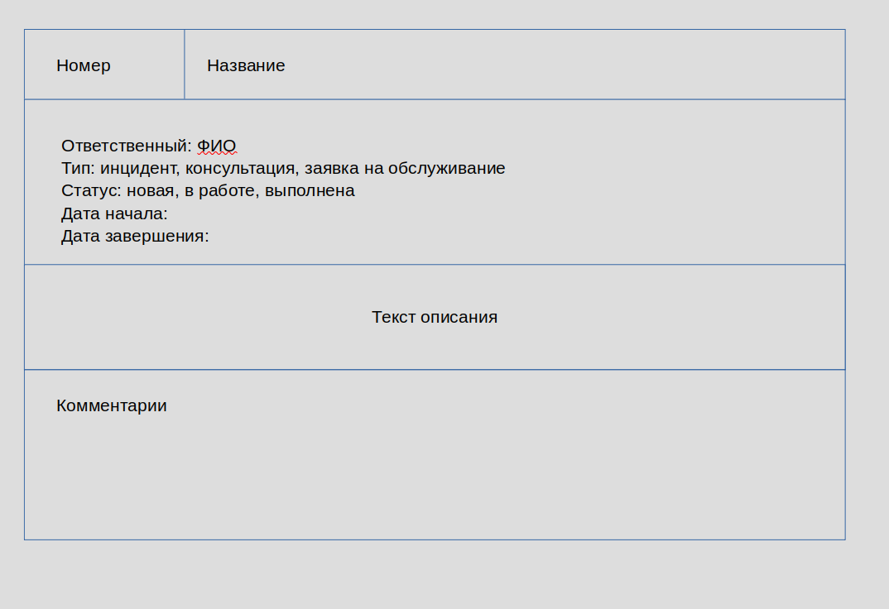
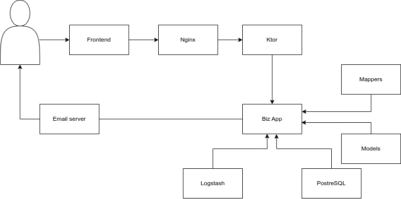

# Проект track

Система ведения заявок пользователей интернет провайдера. Представляет собой набор заявок, хранящихся в БД
с оповещением по email об изменении статуса.

# Портрет пользователя

## Клиент

Пользователь интернет провайдера различного уровня компьютерной образованности.

## Оператор технической поддержки

1. Человек средних лет
2. Начальный или средний уровень IT подготовки
3. Высшее, неоконченное высшее или средне специальное техничское образование

# MVP

Представляет собой web приложение с минимальным дизайном. 

Клиенту должны быть доступны возможности:
1. Авторизация по номеру договора и паролю
2. Создание заявки
3. Добавление комментариев

Оператору должны быть доступны возможности:
1. Авторизация по логину и паролю
2. Добавление комментариев
3. Управление статусом заявки
4. Передача другому оператору

## Эскиз заявки

# Основные сущности

## Заявка

Атрибуты:
1. Номер
2. Тема
3. Описание
4. Ответственный
5. Тип
6. Статус
7. Дата создания
8. Дата завершения
9. Список комментариев

### Создание
Атрибуты:
1. Название темы
2. Описание
3. Тип (из списка)

### Обновление
Атрибуты:
1. Назначение ответственного (id пользователя с ролью "оператор")
2. Статус (из списка)
3. Добавление/изменение/удаление комментария

### Чтение
Атрибуты:
1. id заявки

### Поиск
Атрибуты:
1. Фрагмент темы
2. id ответственного

### Удаление

## Комментарий

Атрибуты:
1. Текст
2. Автор
3. Дата добавления
4. Номер заявки
5. Номер комментария

# API

## Описание сущности заявки (ticket)
1. ID
2. Subject
3. Description
4. Owner
5. State: New/Progress/Finish
6. CreationDate
7. FinishDate
8. Comment
   1. ID
   2. Author
   3. CreationDate
   4. Text

## Функции (эндпониты)

1. CRUDS (create, read, update, delete, search) для заявки (ticket)
2. ticket.waits получение открытых заявок, в которых последнй комментарий не от ответственного    

# Общая схема
